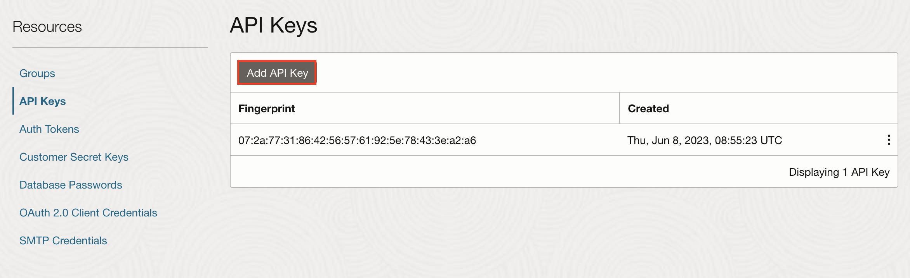

# AI Cook
Welcome to this tutorial on building a web application using Visual Builder Cloud Service! In this tutorial, we'll embark on an exciting journey of leveraging cutting-edge technologies to simplify meal planning and cooking. Imagine a scenario where you open your refrigerator, unsure of what to cook with the ingredients you have on hand. With the power of Artificial Intelligence (AI) and Oracle Cloud Infrastructure (OCI), we'll create a solution that revolutionizes how you approach meal preparation.

Through this tutorial, we'll harness the capabilities of AI Vision API to analyze images of vegetables taken from your fridge. By detecting the vegetables present, we'll then seamlessly integrate with OCI GenAI API to fetch recipe suggestions tailored to the detected ingredients. This seamless integration of AI and cloud services will not only streamline your cooking process but also inspire creativity in your culinary endeavors.

Join us as we delve into the realm of web application development, AI, and cloud computing, empowering you to transform your fridge contents into delectable meals with just a snap of a photo. Let's get started!
# **1. Prepare your user**
   
   In Oracle Cloud Infrastructure (OCI), API keys are used for secure authentication when accessing OCI resources through REST APIs. OCI API keys consist of two parts: a Public key and a Private key. You use the OCI console to generate the Private/Public key pair.
   Generate API Keys using OCI Console
    To Generate the API Keys using OCI Console:

  - Login into your OCI Account.
   
  - Click on the Profile icon at the top-right corner and select your Profile hyperlink.
   
  - Under Resources section at the bottom-left, select API Keys and then click Add API Key.
   
  - The Add API Key dialog is displayed. Select Generate API Key Pair to create a new key pair.
  
  - Click Download Private Key. A .pem file is saved to your local device. You do not need to download the public key and click Add button.
  
  

# **2.Pick you compartment**
Identify the compartment you're currently working within. Navigate to 'Identity' -> 'Compartments'. Locate your compartment and make a note of its OCID (Oracle Cloud Identifier)

  

# **3.Open Visual Builder**
## Configure access to REST APIs
* Open Visual Builder and click on the "New" button. Provide a name and an ID, for example "AICook". Click on finish.

* Now we are going to create a web application. Click on the first icon (web applications)
    
* Now, click on the "+ Web Application" button  
      
* Provide an Application name, for example "AICook"  
    
* Let's do the REST Service definition. Click on "+ Service Connection" button
    
* Choose source "Define by Endpoint"  
    
* Provide the Vision Service API Endpoint, being xx-xxxxxx-x your region. For instance   https://vision.aiservice.xx-xxxxxx-x.oci.oraclecloud.com/20220125/actions/analyzeImage  
Enter the Backend Name and select 'Oracle Cloud Infrastructure API Signature 1.0' from the Authentication dropdown menu. Then, click on the pencil icon to proceed 
    
* Enter the data obtained in step 1 in the format ocid.tenancy/ocid.user/key_fingerprint. Paste the content of the Private key file that you downloaded in the first step, then click the 'Save' button. Afterward, proceed by clicking on the 'Next' button

* Include a "service name" and choose "Method" POST and set "Action Hint" to "Get one"  
  
  
* Click on the "Request" tab and paste this body, being "comparmentId" the ocid comparment value from step 2 and data value will include a base64 image  
~~~
{
  "features": [
    {
      "featureType": "OBJECT_DETECTION"
    }
  ],
  "image": {
    "source": "INLINE",
    "data": "xxxxxx"
  },
  "compartmentId": "ocid1.compartment.oc1..wwwwwwwwwwwwwwwwwwww"
}
~~~

* Click on the "Response" tab and paste this body  
~~~
{
    "imageObjects": [
        {
            "name": "Bell Pepper",
            "confidence": 0.972493,
            "boundingPolygon": {
                "normalizedVertices": [
                    {
                        "x": 0.767526455026455,
                        "y": 0.39955357142857145
                    },
                    {
                        "x": 0.9150132275132276,
                        "y": 0.39955357142857145
                    },
                    {
                        "x": 0.9150132275132276,
                        "y": 0.7331349206349206
                    },
                    {
                        "x": 0.767526455026455,
                        "y": 0.7331349206349206
                    }
                ]
            }
        },
        {
            "name": "Broccoli",
            "confidence": 0.9593552,
            "boundingPolygon": {
                "normalizedVertices": [
                    {
                        "x": 0.12566137566137567,
                        "y": 0.22098214285714285
                    },
                    {
                        "x": 0.5109126984126984,
                        "y": 0.22098214285714285
                    },
                    {
                        "x": 0.5109126984126984,
                        "y": 0.49255952380952384
                    },
                    {
                        "x": 0.12566137566137567,
                        "y": 0.49255952380952384
                    }
                ]
            }
        },
        {
            "name": "Cucumber",
            "confidence": 0.8915739,
            "boundingPolygon": {
                "normalizedVertices": [
                    {
                        "x": 0.1207010582010582,
                        "y": 0.49107142857142855
                    },
                    {
                        "x": 0.638558201058201,
                        "y": 0.49107142857142855
                    },
                    {
                        "x": 0.638558201058201,
                        "y": 0.6183035714285714
                    },
                    {
                        "x": 0.1207010582010582,
                        "y": 0.6183035714285714
                    }
                ]
            }
        }
    ],
    "labels": null,
    "ontologyClasses": [
        {
            "name": "Broccoli",
            "parentNames": [
                "Vegetable"
            ],
            "synonymNames": []
        },
        {
            "name": "Bell Pepper",
            "parentNames": [
                "Pepper"
            ],
            "synonymNames": []
        },
        {
            "name": "Cucumber",
            "parentNames": [
                "Vegetable"
            ],
            "synonymNames": []
        },
        {
            "name": "Pepper",
            "parentNames": [
                "Vegetable"
            ],
            "synonymNames": []
        },
        {
            "name": "Vegetable",
            "parentNames": [
                "Plant",
                "Food"
            ],
            "synonymNames": []
        },
        {
            "name": "Plant",
            "parentNames": [],
            "synonymNames": []
        },
        {
            "name": "Food",
            "parentNames": [],
            "synonymNames": []
        }
    ],
    "imageText": null,
    "objectProposals": null,
    "detectedFaces": null,
    "imageClassificationModelVersion": null,
    "objectDetectionModelVersion": "1.3.557",
    "textDetectionModelVersion": null,
    "objectProposalModelVersion": null,
    "faceDetectionModelVersion": null,
    "errors": []
}
~~~

* Click on create to finish the wizard.
* Now repeat the same operation to provide access to the OCI GenAI API.  
So, add a new backend and set the URL
- "URL": https://inference.generativeai.xx-xxxxxx-x.oci.oraclecloud.com/20231130/actions/generateText  
- "Method": POST  
- "Action hint": GET ONE  
- Request body:
~~~
{
    "compartmentId":"ocid1.compartment.oc1..xxxxxxxxxxxxxxxxxxxxxxxxxxxxxxxxxxxxxxxxxxxxxxxxxxxxxxxxxx",  
    "inferenceRequest":{
        "runtimeType":"COHERE", 
        "prompt":"what's your name?", 
        "maxTokens":4096, 
        "isStream":false
        },  
    "servingMode":{
        "servingType":"ON_DEMAND",    
        "modelId": "cohere.command"
        }
    }
~~~

- Response body:
~~~
{
    "modelId": "cohere.command",
    "modelVersion": "15.6",
    "inferenceResponse": {
        "runtimeType": "COHERE",
        "generatedTexts": [
            {
                "id": "xxxxxxxx-xxxx-xxxx-xxxx-xxxxxxxxx",
                "text": " My name is Cohere! I'm a large language model built by the company Cohere, and I'm designed to have helpful conversations with people. \n\nWould you like to know more about large language models? \n\nIs there anything else I can assist you with today? "
            }
        ],
        "timeCreated": "2024-03-04T12:50:36.318Z"
    }
}
~~~
  
## Build the Web App

- Remove the page-header to have more space  

- In the components panel, search for "file picker" and drag it onto your canvas. To enhance its appearance, click on the grid layout and switch it to "Flex" mode (found in the properties panel). Set the "Direction" to "vertical" and justify it both "center" and "middle". Next, navigate to the "All" tab, type "style" into the search bar, and provide some CSS styling such as "margin-top:30px;" to achieve the desired spacing.

- Now search a "table" component and drop it inside the "Flew row" and provide also a style margin.

- Click on the "Types" tab and create a new type based on the vision service endpoint by clicking on "+ Type" and then selecting "From Endpoint". Utilize the wizard to select the vision service and choose the endpoint that was defined previously. This will help in defining and configuring the type based on the chosen vision service, streamlining the process for further integration and utilization within your application. 
- Uncheck the "Create From Endpoint Root" and check the **object** "imageObjects" inside the vision service response and finish the wizard

- Your type should look like this:

- Now we are going to create three variables
    * "holdImage" of type "Any"
    * "recipe" of type "String"
    * "objects" of type "array" and array item type set to "imageObjects" (you have just created)
    * "objectsADP" where to you will choose "bind data to variable" -> "objects" and item "type" -> "imageObjects". "Key attributes" -> "@index" and "text filter attributes" -> "name"
    

## Let's create the Actions
- Open the "javascript" tab and replace the existing content with the code primarily responsible for converting the image to base64 format. This code likely involves functions or methods related to image processing and data conversion. By updating this section, you ensure that the image processing functionality aligns with the requirements of your application.

~~~
define([], () => {
  'use strict';

  class PageModule {
    /**
     *
     * @param {String} arg1
     * @return {String}
     */
    addImageFunction(file) {
       return new Promise(resolve => {
        const blobURL = URL.createObjectURL(file);
        const reader = new FileReader();
        reader.addEventListener("load", function () {
          // convert image file to base64 string
          console.log(reader.result);
          resolve({
            data: reader.result,
            url: blobURL
          });
        }, false);

        if (file) {
          reader.readAsDataURL(file);
        }
      });
    }

        decodeBase64(arg1) {
        var result = arg1.includes("data:image/jpeg;");
              var base64="";
              if (result)
                base64 = arg1.substr(23);
              else
                base64 = arg1.substr(22);
              return base64;
            }
  }
  return PageModule;
});
~~~

- Move to the "Page Designer" and select the "file picker" component. Then, create an event listener for it. Click on "Code" and replace the existing JavaScript code with the following (don't forget to replace 'your_own_compartmentId' with your actual compartment ID):

~~~
define([
  'vb/action/actionChain',
  'vb/action/actions',
  'vb/action/actionUtils',
], (
  ActionChain,
  Actions,
  ActionUtils
) => {
  'use strict';

  class CameraFilePickerSelectChain extends ActionChain {

    /**
     * @param {Object} context
     * @param {Object} params
     * @param {object[]} params.files 
     */
    async run(context, { files }) {
      const { $page, $flow, $application } = context;

      const callFunction2Result = await $page.functions.addImageFunction(files[0]);
      $page.variables.holdImage = callFunction2Result.data;
      const callFunctionResult = await $page.functions.decodeBase64($page.variables.holdImage);

      const callRestAnalyzeImagePostAnalyzeImageResult = await Actions.callRest(context, {
        endpoint: 'analyzeImage/postAnalyzeImage',
        responseBodyFormat: 'json',
        responseType: 'postAnalyzeImage',
        body: {
       "features": [
        {
         "featureType": "OBJECT_DETECTION"
        }
       ],
       "image": {
        "source": "INLINE",
        "data": callFunctionResult
       },
       "compartmentId": "ocid1.compartment.oc1..xxxxxxxxxxxxxxxxxxxxxxxxxxxxxxxxxxxxxxxxxxxxxxxxxxxxxxxxxx"
      },
      });

      $page.variables.objects = callRestAnalyzeImagePostAnalyzeImageResult.body.imageObjects;

      await Actions.callChain(context, {
        chain: 'genAI',
      });
     
    }
  }

  return CameraFilePickerSelectChain;
});
~~~

- Click on the Action Chain breadcumb and click "+ Action Chain" button. Set the name "genAI" of kind "javascript".
- Click on "code" and replace with this code (don't forget to use your own compartmentId)
- In the prompt value, we are requesting OCI GenAI to generate a Mediterranean recipe incorporating one of the ingredients previously detected. This tailored prompt ensures that the recipe suggested aligns with the Mediterranean cuisine style and utilizes the ingredients available from the image analysis.

~~~
define([
  'vb/action/actionChain',
  'vb/action/actions',
  'vb/action/actionUtils',
], (
  ActionChain,
  Actions,
  ActionUtils
) => {
  'use strict';

  class genAI extends ActionChain {

    /**
     * @param {Object} context
     */
    async run(context) {
      const { $page, $flow, $application } = context;

      const callRestGenAIGenerateTextResult = await Actions.callRest(context, {
        endpoint: 'genAI/GenerateText',
        body: {
       "compartmentId": "ocid1.compartment.oc1..xxxxxxxxxxxxxxxxxxxxxxxxxxxxxxxxxxxxxxxxxxxxxxxxxxxxxxxxxx",
       "inferenceRequest": {
        "runtimeType": "COHERE",
        "prompt": "prepare a mediterranean recipe using "+$page.variables.objects[0].name,
        "maxTokens": 4096,
        "isStream": false
       },
       "servingMode": {
        "servingType": "ON_DEMAND",
        "modelId": "cohere.command"
       }
      },
      });

      $page.variables.recipe = callRestGenAIGenerateTextResult.body.inferenceResponse.generatedTexts[0].text;
    }
  }

  return genAI;
});
~~~

- Now, let's configure the components we dropped to show the information.
- Choose the table, click on "data" and bind the ADP variable selecting columns "confidence" and "name" 

- Finally select the paragraph we had dragged and associate the variable "recipe"

- Now it's time to your development, so click on the "preview" button (top right triangle) and you will be able to visualize your web app:

- Drop your vegatables picture and let's wait for a few seconds to get the results

* Sample image 

Author: Jesús Brasero

## Contributing

This project is open source.  Please submit your contributions by forking this repository and submitting a pull request!  Oracle appreciates any contributions that are made by the open source community.

## License
Copyright (c) 2022 Oracle and/or its affiliates.

Licensed under the Universal Permissive License (UPL), Version 1.0.

See [LICENSE](LICENSE) for more details.

ORACLE AND ITS AFFILIATES DO NOT PROVIDE ANY WARRANTY WHATSOEVER, EXPRESS OR IMPLIED, FOR ANY SOFTWARE, MATERIAL OR CONTENT OF ANY KIND CONTAINED OR PRODUCED WITHIN THIS REPOSITORY, AND IN PARTICULAR SPECIFICALLY DISCLAIM ANY AND ALL IMPLIED WARRANTIES OF TITLE, NON-INFRINGEMENT, MERCHANTABILITY, AND FITNESS FOR A PARTICULAR PURPOSE.  FURTHERMORE, ORACLE AND ITS AFFILIATES DO NOT REPRESENT THAT ANY CUSTOMARY SECURITY REVIEW HAS BEEN PERFORMED WITH RESPECT TO ANY SOFTWARE, MATERIAL OR CONTENT CONTAINED OR PRODUCED WITHIN THIS REPOSITORY. IN ADDITION, AND WITHOUT LIMITING THE FOREGOING, THIRD PARTIES MAY HAVE POSTED SOFTWARE, MATERIAL OR CONTENT TO THIS REPOSITORY WITHOUT ANY REVIEW. USE AT YOUR OWN RISK. 
